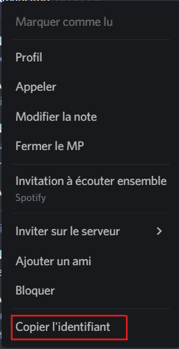

# BostoNaski
### Un Bot discord développé avec NodeJs qui souhaite les anniversaires

<br><br>

# __Sommaire__
* [Informations generales](#informations-genrales)
* [Setup](#setup)
* [Fichiers manquants](#fichiers-manquants)
* [Conclusion](#conclusion)

# __Informations genrales__
Il s'agit d'un projet créé par une étudiante en 2eme année d'informatique.
Ce bot a été créé dans le but de souhaiter les anniversaires sur un server discord.
L'objectif principal étant de **ne pas oublier les anniversaires de ses amis**.<br>
I will regularly add new scripts and types of encryption / decryption.

# __Configuration__
## Pour faire fonctionner ce bot :
Le Bot a été développé en NodeJs donc faites attention à bien avoir installé NodeJs : 
```
sudo apt install nodejs
```
<br>
Pour récupérer le code et l'executer :
```
git clone https://github.com/NiouiNinoon/BostoNaski <wbr>
npm install<br>
npm server
```

# __Fichiers manquants__
## __config.json__<br>
```json
{
    "prefix":"your prefix",
    "token": "the token of your bot"
}
```
Ce fichier permet de relier votre bot Discord à votre application.

## __data/anniv.json__<br>
exemple de fichier :
```json
{
 "tab": [
  {
   "anniversaires": [
    {
     "id": "4927213867255729",
     "name": "Gilbert",
     "anniv": "21/12/2012"
    },
    {
     "id": "0",
     "name": "Didier",
     "anniv": "1/3/1913"
    }
   ]
  },
  {
   "dateJour": [
    {
     "date": "23/10"
    }
   ]
  }
 ]
}
```
Ce fichier contient un tableau de tout les anniversaires à souhaiter ainsi que la date du jour (mise à jour automatiquement par le bot).
L'identifiant discord se trouve en faisant clique droit sur le personne puis copier identifiant (voir image ci-dessous).<br><br>
<br><br>


# __Conclusion__
Ce dossier git ne vous permet pas d'utiliser mon bot mais en revanche, il vous permet de récréer votre propre bot à partir de ce code.
