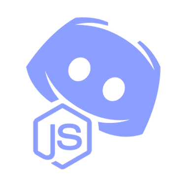

# BostoNaski
### Un Bot discord développé avec NodeJs qui souhaite les anniversaires

<br><br>

# __📋 Sommaire__
* [Informations generales](#📖 informations-genrales)
* [Setup](#setup)
* [Fichiers manquants](#fichiers-manquants)
* [Origine du nom](#origine-du-nom)
* [Conclusion](#conclusion)

# __📖 Informations genrales__
Il s'agit d'un projet créé par une étudiante en 2eme année d'informatique.
Ce bot a été créé dans le but de souhaiter les anniversaires sur un server discord.
L'objectif principal étant de **ne pas oublier les anniversaires de ses amis**.<br>

# __⚙️ Configuration__
## Pour faire fonctionner ce bot :
Le Bot a été développé en NodeJs donc faites attention à bien avoir installé NodeJs : 
```
sudo apt install nodejs
```
<br>
Pour récupérer le code et l'executer :<br><br>

```
git clone https://github.com/NiouiNinoon/BostoNaski
npm install
npm server
```

# __⚙️ Modifictaion à effectuer avant utilisation__
## Dans le fichier config.JSON :
Il vous faut entrer dans ce fichier vos propre informations : préfix du bot (choisi par vous) et token (donné dans votre application sur Discord Portal Developper)
## Dans le fichier anniv.JSON dans le dossier data:
Il vous faut entrer dans ce fichier les informations de vos proches/amis/famille
## Dans le code :
Pour le bon fonctionnement de votre bot vous devrez effectuer quelques modifications représentées dans le code par un commentaire : 
```
//TO-CHANGE : chose à modifier
```

# __🌱 Origine du nom__
**BostoNaski** tire son origine de deux noms:<br>
 - "naskiĝtago" (qui signifie "anniversaire" en Esperanto) 
 - "Ecobosto" (jeune start-up traitant sur l'écologie) qui elle même tire son nom des mots "ekologio", "karbono" et "bonfarto" 
    qui signifie respectivement "écologie", "carbone", "bien-être"

# __Conclusion__
Ce dossier git ne vous permet pas d'utiliser mon bot mais en revanche, il vous permet de récréer votre propre bot à partir de ce code.
